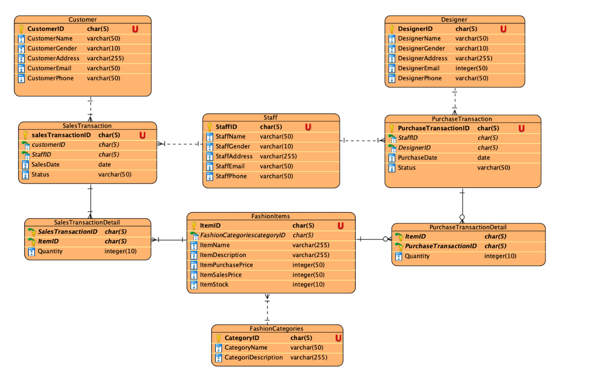

# Modeo-Database-System
An end-to-end Relational Database Management System (RDBMS) design and implementation for Modeo, an innovative digital fashion platform connecting customers, staff, and fashion designers. This project covers database schema definition (DDL), sample data population with business rule constraints (DML), and complex analytical query extraction (Advanced SQL & Subqueries) developed in Oracle APEX.

### Project Overview
Modeo digitizes fashion retail and custom design collaborations. The database is structured to handle:
* **Sales Transactions:** Managing orders placed by customers and processed by internal staff.
* **Purchase Transactions:** Tracking fashion inventory acquired by staff from independent designers.
* **Catalog Management:** Organizing fashion items into distinct categories with stock control and price management.

### Relational Database Schema & Architecture
The database architecture consists of 8 interconnected tables with strong data integrity enforcement (Primary Keys, Foreign Keys, Regex Pattern Checks, and Length Rules):

### Table Structure Summary
1. **`FashionCategories`**: Fashion item categorizations (`CAXXX`).
2. **`FashionItems`**: Detailed catalog including purchase/sales prices and stock (`FAXXX`).
3. **`Customer`**: Registered customer accounts and contact info (`CUXXX`).
4. **`Designer`**: Partnered fashion designers (`DEXXX`).
5. **`Staff`**: Store employees managing transactions (`SMXXX`).
6. **`PurchaseTransaction`** & **`Detail`**: Restock/acquisition transactions (`PUXXX`).
7. **`SalesTransaction`** & **`Detail`**: Customer order fulfillments (`SLXXX`).

### Key SQL Capabilities Implemented
The queries included in this repository address complex operational and business intelligence requirements:
* **Data Definition & Integrity (DDL):** `CREATE TABLE` scripts using `CHECK` constraints with Regular Expressions (`REGEXP_LIKE`) for custom ID formatting, email domain validation, and date/month boundaries.
* **Data Manipulation (DML):** `INSERT ALL` batch operations satisfying multi-record minimum requirements across master and transaction tables.
* **Aggregations & Grouping:** Usage of `SUM`, `COUNT`, `AVG`, `GROUP BY`, and `HAVING` for transaction insights.
* **String & Date Manipulations:** Custom date formatting using `TO_CHAR`, string transformations (`UPPER`, `CONCAT`, `LENGTH`), and date math (`EXTRACT`, `MOD`).
* **Subqueries & Joins:** Advanced relational queries utilizing multi-table `JOIN`s, scalar subqueries, and correlated subqueries for dynamic filtering (e.g., finding transactions below average price or cheapest items).

### Contributors
* Aditya Naufal Erlangga
* Arya Raka Pratama
* Thio Michael Yulianto
* Andhika Hafizh Albana
* Samuel Prima Damanik
